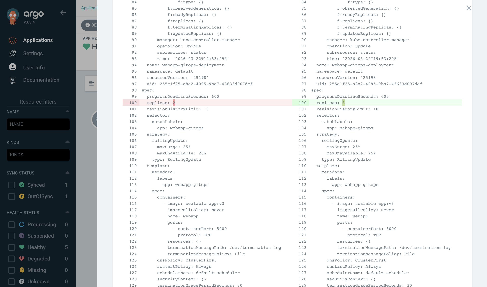
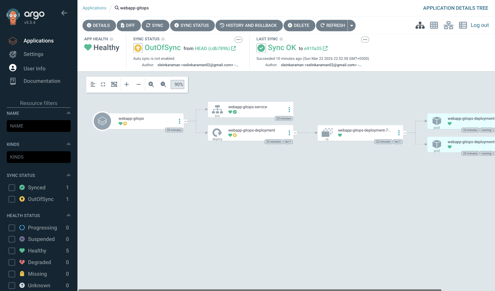
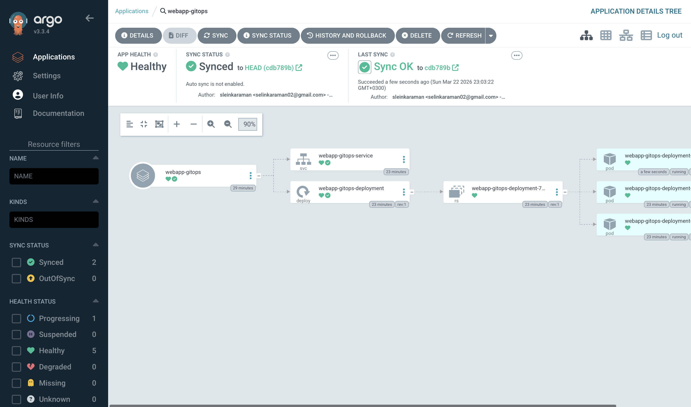

# ArgoCD GitOps Engine ☸️🤖
A declarative GitOps continuous delivery engine built with ArgoCD and Kubernetes. This project demonstrates the "Single Source of Truth" principle by synchronizing a Helm-based web application from GitHub to a local Kubernetes cluster (Minikube).

## 🚀 Overview
The argocd-gitops-engine automates the deployment lifecycle. Instead of manual kubectl commands, the cluster state is managed entirely through Git commits. This project highlights Self-Healing, Automated Synchronization, and Version-Controlled Infrastructure.

# 🛠 Tech Stack
- Orchestration: Kubernetes (Minikube)
- GitOps Tool: ArgoCD
- Package Management: Helm

## 📸 Project Showcases
### 1. GitOps Synchronization (The "Diff" Screen)

This is the core of the project. When the values.yaml is updated in GitHub, ArgoCD detects the Configuration Drift. The image below shows the "Desired State" (Git) vs. "Live State" (Cluster) comparison before synchronization.

 

### 2. Scalability in Action (2 vs 3 Pods)

By simply changing the replicaCount in values.yaml, the cluster automatically scales.

* **State A:** The application running with 2 replicas for resource efficiency.

* **State B:** The application scaling up to 3 replicas to handle increased load.

 

 

## 🔧 Features
- Automated Sync: ArgoCD monitors the webapp directory and applies changes within seconds.
- Self-Healing: Any manual changes in the cluster are automatically overwritten by the Git configuration.
- Visibility: Real-time visualization of Kubernetes resources (Service, Deployment, Pods).
- Local Access: Integrated with minikube tunnel to expose services via LoadBalancer on the local machine.

## How to Run 💻

#### 1. Start Minikube: 
```
minikube start
```

#### 2. Install ArgoCD: 
```
kubectl apply -n argocd -f https://raw.githubusercontent.com/argoproj/argo-cd/stable/manifests/install.yaml
```

#### 3. Apply Application Manifest:
```
kubectl apply -f application.yaml
```
#### 4. Access Dashboard: 
```
kubectl port-forward svc/argocd-server -n argocd 8080:443
```
#### 5. Enable Tunnel:
```
minikube tunnel
```
## 🧠 Key Learning Outcomes

* **GitOps Core:** Implemented Git as the "Single Source of Truth" for automated cluster synchronization.
* **Declarative Infrastructure:** Managed Kubernetes resources using Helm charts and ArgoCD manifests instead of manual commands.
* **Drift Detection:** Mastered App Diff to identify and resolve discrepancies between Git and the live cluster.
* **Automated Scaling:** Observed real-time scaling of pods (from 2 to 3 replicas) triggered solely by Git commits.
* **Kubernetes Networking:** Exposed cluster services to a local environment using minikube tunnel.


